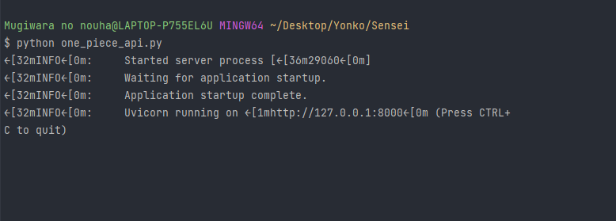
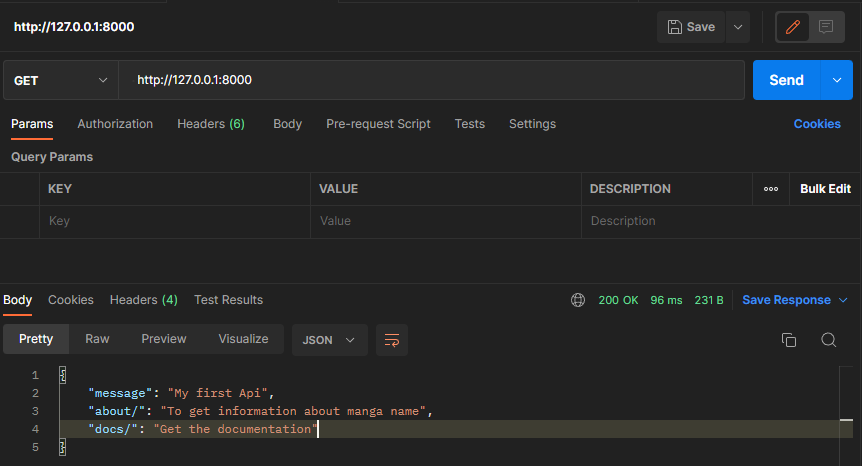

# Welcome to my first api
####  We have three script:
```python
"""
    In one_piece_scrapper.py :
       -> We get all information and added them into the database
    In one_piece_api.py :
       -> We create our api using Fast api
   In views.py :
       -> We create our function and export them in one_piece_api     
"""
     
```
#### When we restart one_piece_scrapper.py, the database will be upgraded 

## API documentation

### How to run api :
```
    python one_piece_api.py
```



### Now copy the url in Postman and copy Path for getting information:




````python
DOCS = {
    "/about/": "Get information about",
    "/docs/": "Documentation.",
    
    "/chapters/": "Get all chapters",
    "/chapters/100/": "Get informations of chapter 100 (Name and Pages)",
    "/chapters/100/name/": "Get name only about chapter 100",
    "/chapters/100/pages/": "Get all images about chapters 10",
    "/chapters/100/pages/13": "Get image only of chapters 13",
}

````

## Best Practice
    Use a API platform  like Postman.
